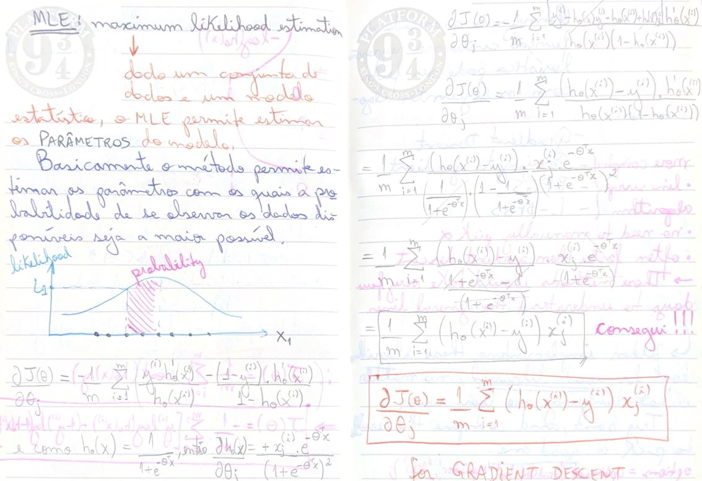
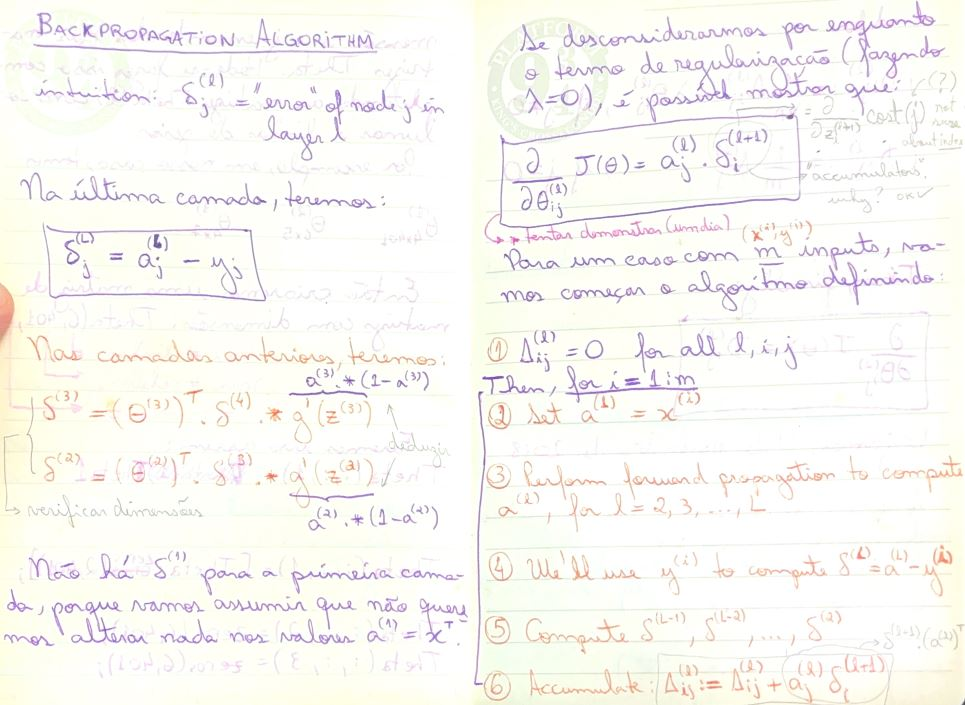
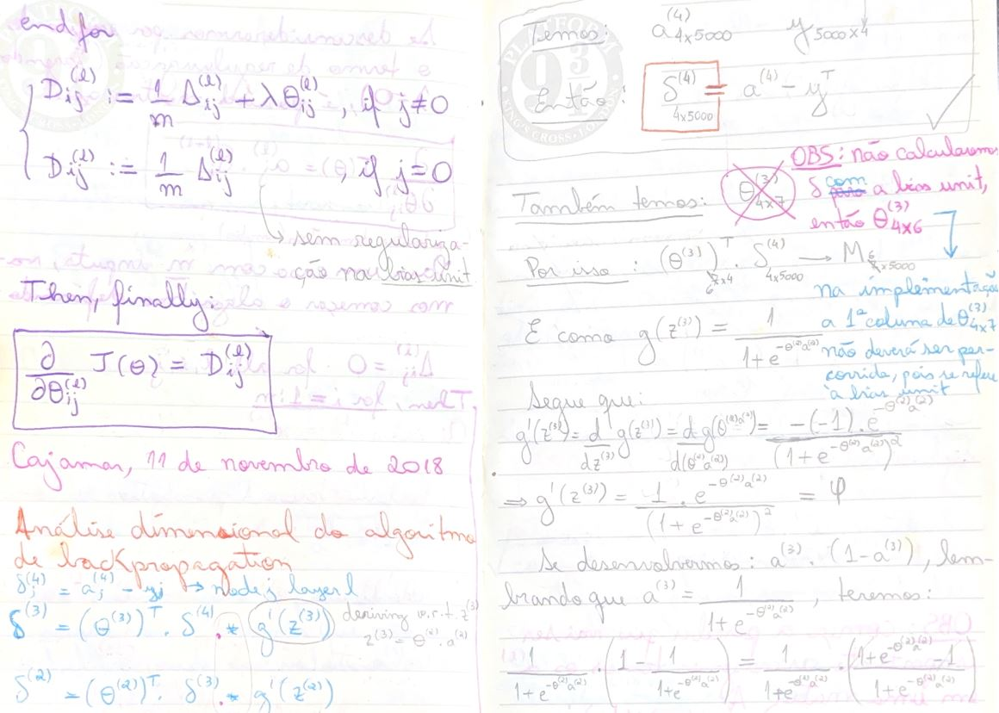
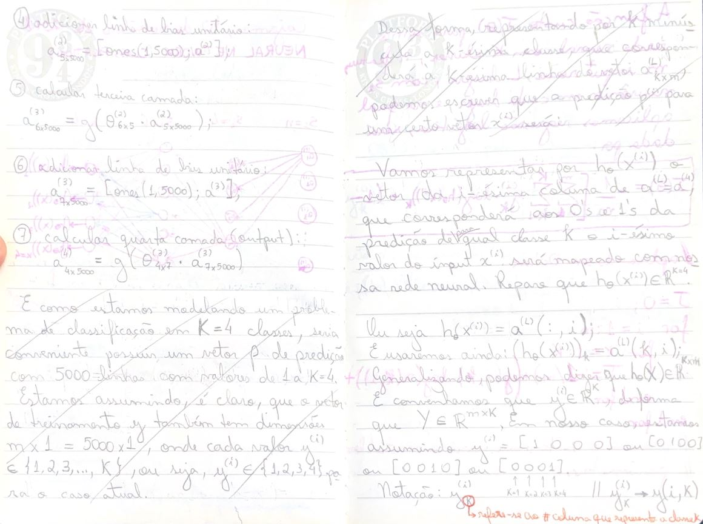
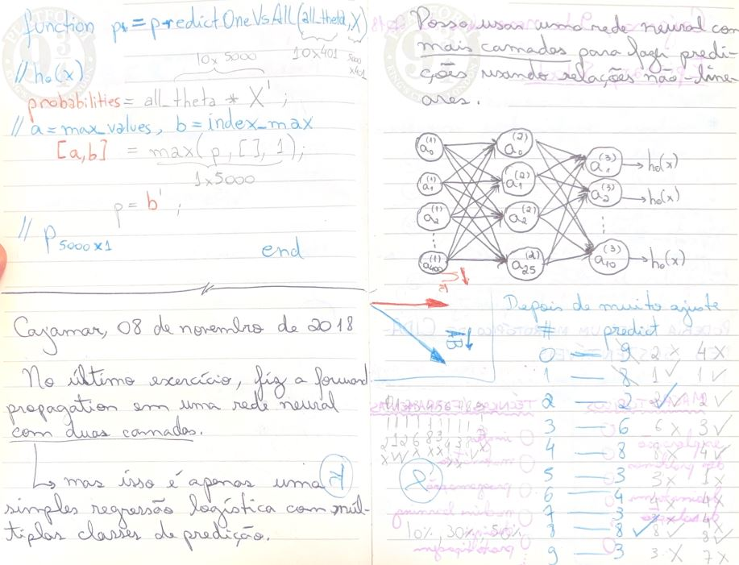
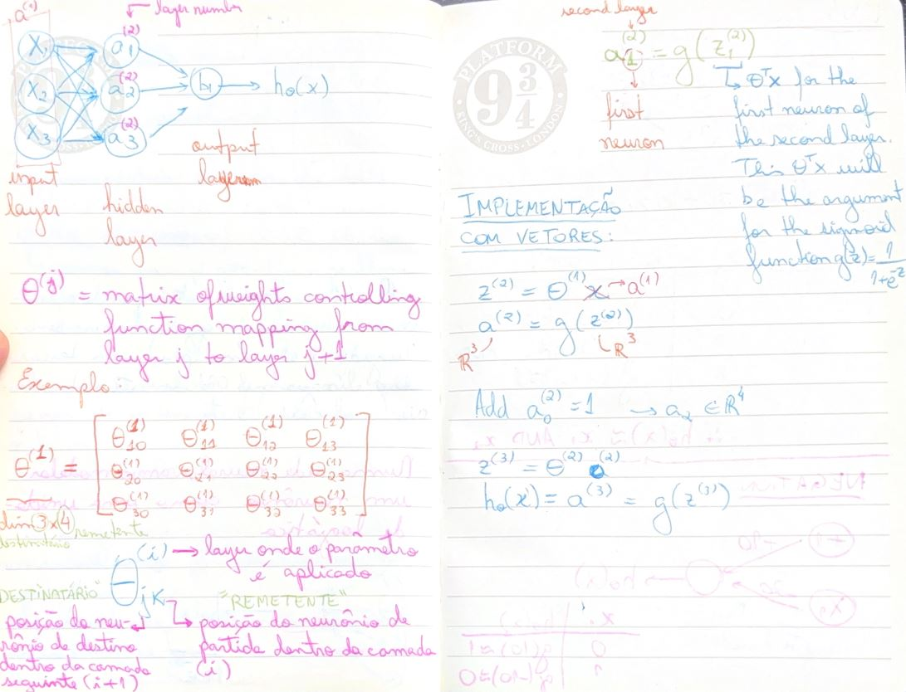

# Handwritten ML Derivations (classic Coursera ML)

The purpose of this repository is to show that I can do math in a high level way, successfully navigating advanced math concepts in linear algebra, statistics, and calculus.

It contains full handwritten derivations I completed while studying classic ML fundamentals (linear/logistic regression, regularization, multiclass, neural networks) back in 2018. Wherever the professor Andrew Ng left steps “as an exercise,” I wrote the complete demonstration—especially around MLE/log-loss gradients, sigmoid derivatives, and backprop dimensions bookkeeping.

**What this signals (beyond “took a course”):**
- Comfort with **linear algebra + calculus** in the service of implementation (matrix form, dimensions, chain rule)
- A correctness mindset: **numerical sanity checks**, shape constraints, bias-unit edge cases
- Independent self-study discipline: reconstructing core results instead of memorizing them

The point is not “I watched a course.” The point is: **I can reconstruct the machinery**—derive gradients, reason in matrix form, sanity-check with numerical approximations, and keep implementations honest with shape checks.

---

## Verified performance signal

- **Coursera credential:** `QGXFU3W83HSD`
- **Reported final grade:** **98.4%**
- Verification link: https://www.coursera.org/account/accomplishments/verify/QGXFU3W83HSD

---

## Fast proof (2-minute skim)

If you read only ~5 minutes of this repo, read these pages.  
They show the full pipeline: **objective → gradient → vectorization → backprop mechanics → shape-safety**.

---

### 1) p-08 — Logistic regression gradient (MLE → clean GD update) **(my derivation)**
**Why it matters:** This is the canonical “hard step” in early ML: taking the MLE/log-loss objective and collapsing the derivative into the clean residual form  
\(\frac{\partial J(\theta)}{\partial \theta_j} = \frac{1}{m}\sum_{i=1}^m (h_\theta(x^{(i)}) - y^{(i)})x_j^{(i)}\), which is exactly what enables vectorized training.

  
[Open PDF](pages-1-10/mangioluci-s-notes-p-08.pdf)

---

### 2) p-23 — Backprop algorithm (setup/context for p-24; not my derivation)
**Why it matters:** This page captures the algorithmic skeleton: \(\delta\) definitions, recursion, and the accumulator loop.  
I’m including it because p-24’s derivations “cash out” these rules (and because many implementations fail when this scaffold is misunderstood).

  
[Open PDF](pages-21-30/mangioluci-s-notes-p-23.pdf)

---

### 3) p-24 — Backprop rigor: Sigmoid derivative + dimensional analysis + bias-unit caveats **(my derivation)**
**Why it matters:** This is where I did the non-handwavy work: derive \(g'(z)=g(z)(1-g(z))\), track shapes through backprop, and explicitly note the bias-unit exceptions that break naïve implementations.

  
[Open PDF](pages-21-30/mangioluci-s-notes-p-24.pdf)

---

### 4) p-20 — Multiclass as linear algebra (\(h(x)\in\mathbb{R}^K\), \(Y\in\mathbb{R}^{m\times K}\))
**Why it matters:** Shows “tensor thinking”: turning K-class classification into matrices you can compute with (and debug).

  
[Open PDF](pages-21-30/mangioluci-s-notes-p-20.pdf)

---

### 5) p-18 — One-vs-all inference, vectorized (probabilities → argmax)
**Why it matters:** Bridges math → implementation: batch probabilities, argmax selection, and shape correctness.

  
[Open PDF](pages-11-20/mangioluci-s-notes-p-18.pdf)

---

### 6) p-14 — NN forward propagation, vectorized (weight-matrix semantics)
**Why it matters:** Forward-prop correctness (especially \(\Theta^{(l)}\) semantics + bias handling) prevents silent errors upstream of training.

  
[Open PDF](pages-11-20/mangioluci-s-notes-p-14.pdf)

---

## What’s inside

This repo stores the handwritten pages as **per-page PDFs**:

- `pages-1-10/` — `mangioluci-s-notes-p-01.pdf` … `mangioluci-s-notes-p-10.pdf`
- `pages-11-20/` — `mangioluci-s-notes-p-11.pdf` … `mangioluci-s-notes-p-20.pdf`
- `pages-21-30/` — `mangioluci-s-notes-p-21.pdf` … `mangioluci-s-notes-p-30.pdf`
- `pages-31-36/` — `mangioluci-s-notes-p-31.pdf` … `mangioluci-s-notes-p-36.pdf`

---

## Index

This index is designed for a recruiter or engineer to jump straight to “proof of math” quickly.

| Topic | What you’ll see | Where |
|------|------------------|------------------------|
| Linear Regression | Cost \(J(\theta)\), partial derivatives, gradient descent update rule, vectorization notes | p. 1–5 |
| Normal Equation | Closed-form \(\theta = (X^TX)^{-1}X^Ty\), tradeoffs vs GD | p. 5–7 |
| Pseudo-inverse | Pseudo-inverse intuition + use in least squares | p. 7–8 |
| Logistic Regression | Sigmoid, log-loss, likelihood framing, gradient derivation | p. 9–12 |
| Regularization (L2) | Adds penalty term, modifies gradients / equations | p. 12–14 |
| Multiclass (One-vs-All) | Setup + prediction via argmax | p. 14–15 |
| Neural Nets (Setup) | Forward prop notation, NN cost function, shape bookkeeping | p. 15–20 |
| Feature Explosion | Polynomial feature mapping intuition (combinatorics blow-up) | p. 20–24 |
| Backpropagation | Chain rule across layers, \(\delta\) terms, vectorized gradients | p. 25–30 |
| Parameter Unrolling | Reshaping \(\Theta\) into vectors for optimizers, gradient vectorization | p. 27–30 |
| Gradient Checking | Finite-difference approximation as sanity check | p. 30–31 |
| Random Initialization | Symmetry breaking + ranges/epsilon intuition | p. 31–32 |
| Bias vs Variance | Learning curves, diagnostics, remedies by failure mode | p. 33–36 |

---

## Rigor note (why these aren’t “just notes”)

I explicitly wrote out **most formula demonstrations that the professor left as exercises**—full symbolic steps, not hand-wavy intuition.

Recurring advanced-math signals you’ll notice:

- gradients derived from the objective (not copied),
- careful vector/matrix shape tracking,
- chain-rule bookkeeping through multi-layer networks,
- numerical gradient checking to validate analytic gradients,
- explicit bias/variance diagnosis patterns.

---

## How to browse quickly

1) Start with **Fast proof (2-minute skim)** above.
2) Jump to the **Index** row that matches what you care about.
3) Open the corresponding per-page PDFs.

---

## Language

Mixed **Portuguese** + **English** (whatever was fastest while doing the work).